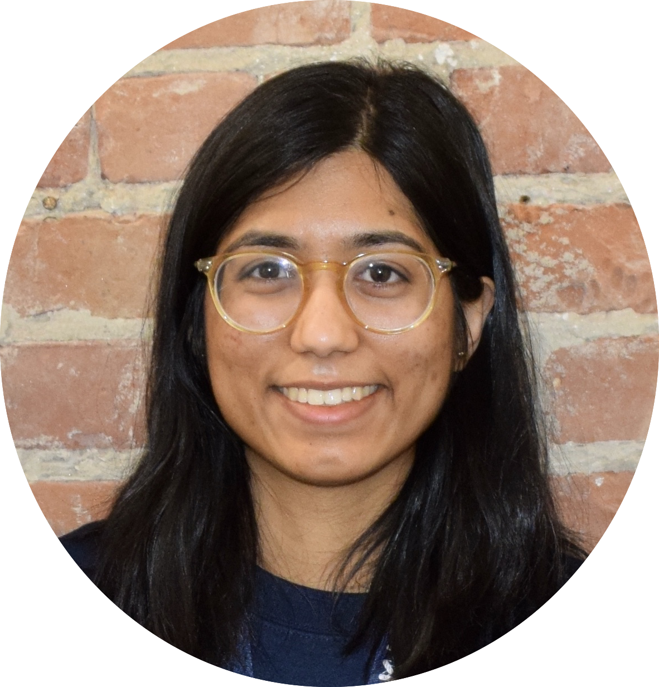

---
---

Hey, I’m Jenisha. I was born, raised and educated in Montreal, Canada 🇨🇦. I'm currently working full-time as a Junior Software Engineer at Cisco, doing cool [VoIP stuff](https://www.cisco.com/c/en/us/products/unified-communications/broadworks/index.html).

I have previously done Data Science on very large things at the Canadian Space Agency 🔭 and research on very small things at Computational Bioengineering and Genomics labs 🔬.

I am passionate about using technology for social good and increasing diversity in STEM. During my undergrad at McGill University, I have helped lead the fabrication of a [brain-controlled wheelchair](https://github.com/NTX-McGill/NeuroTechX-McGill-2019) for severely disabled patients and lead the expansion of McGill Women in Computer Science [(McWiCS)](https://www.facebook.com/McWiCS/) at its co-president.

When I'm not working, I like to explore new places, go to concerts, come up with cringy memes and experiment with new recipes.

## 👋🏻 Say hi

You can easily reach me by [email](mailto:jenisha.patel@mail.mcgill.ca). You can also find me on [LinkedIn](https://www.linkedin.com/in/jeniptl/) and [Github](https://github.com/jenip13).

## 📍 What I’m doing now (outside of work)

- Volunteering for [Vital Voices](https://vitalvoicesinnovationlab.io)
- Taking a remote class at Georgia Tech's College of Computing 

Last updated August 16, 2020

## 📠 Fun facts

- I'm most productive at writing code at 2 AM while listening to Beyoncé
- I'm fluent in English and français: however, I speak English with a slight French accent et je parle français avec un accent anglophone
- I'm selectively ambidextrous depending on the activity: I can eat but not write with both hands 
